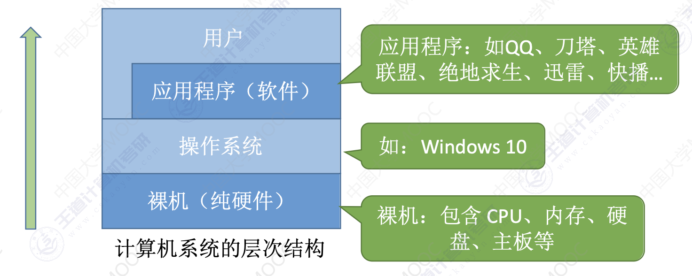

# 第一章 操作系统概述

# 01 引入
## 1.1 操作系统的概念

### 1.1.1 计算机系统的层次结构
- 用户层：通过操作系统的接口使用计算机
- 操作系统层：作为系统资源的管理者，向上提供接口，向下管理硬件
- 应用程序层：运行在操作系统上的软件（如QQ、浏览器等）
- 硬件层（裸机）：包含CPU、内存、硬盘、主板等物理组件

### 1.1.2 操作系统的定义
- 操作系统（Operating System，OS）是控制和管理整个计算机系统的硬件和软件资源，并合理地组织调度计算机的工作和资源分配的系统软件
- 它是计算机系统中最基本的系统软件
- 操作系统位于硬件和用户之间，是用户与计算机硬件之间的接口

## 1.2 操作系统的功能和目标

### 1.2.1 作为系统资源的管理者
- CPU管理：处理机分配、进程调度
- 存储器管理：内存分配、回收、地址转换
- 文件管理：文件的存储、检索、共享和保护
- 设备管理：设备分配、缓冲管理、设备驱动

### 1.2.2 向上层提供方便易用的服务
- 用户接口：
  - GUI（图形用户接口）：如Windows的图形界面
  - 联机命令接口（交互式命令接口）：如Windows的CMD命令行
  - 脱机命令接口（批处理命令接口）：如.bat批处理文件
  - 程序接口（系统调用）：**应用程序请求操作系统服务的唯一方式**

### 1.2.3 作为最接近硬件的层次
- 操作系统将硬件资源抽象化，提供统一的管理界面
- 将裸机（纯硬件）改造成功能更强、使用更方便的虚拟机
- 对硬件的拓展：合理组织CPU、内存、磁盘、显示器、键盘等硬件，实现复杂功能
- 用户无需关心底层硬件的实现细节，只需使用操作系统提供的接口

# 02 操作系统的四个特征

## 1. 并发性

### 1.1 并发的定义
- 并发：指两个或多个事件在同一时间间隔内发生
- 这些事件宏观上是同时发生的，但微观上是交替发生的
- 操作系统的并发性指计算机系统中"同时"运行着多个程序，宏观上看是同时运行，微观上看是交替运行

### 1.2 并行与并发的区别
- **并行**：两个或多个事件在同一时刻同时发生
- **并发**：两个或多个事件在同一时间间隔内发生，宏观同时，微观交替

### 1.3 并发性的实现
- 操作系统是伴随着"多道程序技术"而出现的
- **单核CPU**同一时刻只能执行一个程序，各个程序只能**并发**地执行
- **多核CPU**同一时刻可以同时执行多个程序，多个程序可以**并行**地执行
- 即使是多核CPU，当需要运行超过CPU核心数的程序时，并发性依然必不可少

## 2. 共享性

### 2.1 共享的定义
- 共享即资源共享，是指系统中的资源可供内存中多个并发执行的进程共同使用
- 两种共享方式：
  - 互斥共享：资源在一段时间内只允许一个进程访问（如摄像头）
  - 同时共享：资源在一段时间内允许多个进程"同时"访问（如硬盘）

### 2.2 共享的生活实例
- 互斥共享：使用QQ和微信视频，同一时间段内摄像头只能分配给其中一个进程
- 同时共享：使用QQ发送文件A，同时使用微信发送文件B，宏观上看两边都在同时读取并发送文件，微观上看是交替访问硬盘

### 2.3 并发与共享的关系
- 并发性指计算机系统中同时存在着多个运行着的程序
- 共享性是指系统中的资源可供内存中多个并发执行的进程共同使用
- 如果失去并发性，则系统中只有一个程序正在运行，共享性失去存在的意义
- 如果失去共享性，则无法实现并发，资源无法被多个程序同时使用

## 3. 虚拟性

### 3.1 虚拟的定义
- 虚拟是指把一个物理上的实体变为若干个逻辑上的对应物
- 物理实体（前者）是实际存在的，而逻辑上对应物（后者）是用户感受到的

### 3.2 虚拟技术的实现
- **空分复用技术**（如虚拟存储器）：
  - 例：GTA5需要4GB内存，QQ需要256MB，迅雷需要256MB，网易云音乐需要256MB
  - 实际只有4GB内存，通过虚拟存储器技术，在用户看来似乎远远大于4GB

- **时分复用技术**（如虚拟处理器）：
  - 例：单核CPU的电脑中同时运行多个程序
  - 实际只有一个单核CPU，通过时分复用技术，在用户看来似乎有多个CPU在同时服务

### 3.3 虚拟性与并发性的关系
- 如果失去了并发性，则一个时间段内系统中只需运行一道程序，失去了实现虚拟性的意义
- 因此，没有并发性，就谈不上虚拟性

## 4. 异步性

### 4.1 异步的定义
- 异步是指，在多道程序环境下，允许多个程序并发执行
- 由于资源有限，进程的执行不是一贯到底的，而是走走停停，以不可预知的速度向前推进

### 4.2 异步性的原因
- 并发运行的程序会争抢着使用系统资源
- 系统中的资源有限，因此进程的执行不是一贯到底，而是走走停停的
- 以不可预知的速度向前推进，这就是进程的异步性

### 4.3 异步性与并发性的关系
- 如果失去了并发性，即系统只能串行地运行各个程序，那么每个程序的执行会一贯到底
- 只有系统拥有并发性，才有可能导致异步性

## 5. 四个特征之间的关系

### 5.1 基本特征与派生特征
- **并发和共享是操作系统最基本的特征**
- 虚拟和异步是由并发和共享引起的，是派生特征

# 03 操作系统的发展与分类

**发展阶段**：

手工操作 → 单道批处理 → 多道批处理 → 分时 → 实时

## 1. 手工操作阶段
- **主要特点**：
  - 用户独占全机，计算机等待用户手工操作（如安装纸带）
  - 计算机的输入/输出设备使用效率极低
- **缺点**：
  - 资源利用率极低
  - 人机速度矛盾导致效率低下

## 2. 批处理阶段

### 2.1 单道批处理系统
- **技术改进**：
  - 引入脱机输入/输出技术（使用外围机和磁带）
  - 监督程序负责控制作业的输入、输出
- **优点**：
  - 缓解了一定程度的人机速度矛盾
  - 资源利用率有所提升
- **缺点**：
  - 内存中只能有一道程序运行，该程序运行结束后才能调入下一道程序
  - CPU大量时间空闲等待I/O完成，资源利用率依然很低

### 2.2 多道批处理系统
- **技术改进**：
  - 每次往内存中读入多道程序
  - 操作系统正式诞生，用于支持多道程序并发运行
- **优点**：
  - 多道程序并发执行，共享计算机资源
  - 资源利用率大幅提升，CPU和资源更能保持"忙碌"状态
  - 系统吞吐量增大
- **缺点**：
  - 用户响应时间长
  - 没有人机交互功能（用户提交作业后只能等待处理完成）

## 3. 分时操作系统
- **工作方式**：
  - 计算机以时间片为单位轮流为各个用户/作业服务
  - 各个用户可通过终端与计算机进行交互
- **优点**：
  - 用户请求可以被即时响应
  - 解决了人机交互问题
  - 允许多个用户同时使用一台计算机，操作相互独立
- **缺点**：
  - 不能优先处理紧急任务
  - 对所有用户/作业完全公平，不区分任务紧急性

## 4. 实时操作系统
- **特点**：
  - 能优先响应紧急任务，某些紧急任务不需时间片排队
  - 计算机系统接收到外部信号后及时处理，并在严格时限内完成
  - 主要特点是及时性和可靠性
- **分类与例子**：
  - 硬实时系统：必须在严格规定时间内完成（如导弹控制系统）
  - 软实时系统：可容忍一定延迟（如12306火车订票系统）

## 5. 其他几种操作系统

### 5.1 网络操作系统
- **特点**：
  - 伴随计算机网络发展而诞生
  - 把网络中各个计算机有机结合，实现数据传送
  - 实现网络资源共享和计算机间通信
- **例子**：
  - WindowsNT（用于网站服务器等）

### 5.2 分布式操作系统
- **特点**：
  - 分布性和并行性
  - 系统中各台计算机地位相同
  - 工作可分布到各计算机上，并行、协同完成
- **优势**：
  - 提高系统可靠性和计算能力
  - 资源共享和负载均衡

### 5.3 个人计算机操作系统
- **特点**：
  - 方便个人使用
- **例子**：
  - WindowsXP、MacOS

# 04 操作系统的运行机制

## 1. 程序运行的原理
### 1.1 程序运行的过程
- 高级语言代码（如C语言）通过编译器翻译成机器指令（二进制）
- 一条高级语言代码可能对应多条机器指令
- 程序运行的本质是CPU执行一条条机器指令的过程

### 1.2 指令的本质
- **指令**：CPU能识别、执行的最基本命令
- 注意：区别于Linux/Windows命令行中的交互式命令（后者是用户接口）

## 2. 内核程序与应用程序
### 2.1 应用程序
- 由普通程序员编写
- 运行在用户态
- 只能使用非特权指令

### 2.2 内核程序
- 由操作系统开发人员（如微软、苹果）编写
- 组成"操作系统内核"（Kernel）
- 是操作系统最核心、最接近硬件的部分
- 运行在核心态，可执行特权指令和非特权指令
- 作用：管理系统资源、提供服务接口

## 3. 特权指令与非特权指令
### 3.1 特权指令
- 影响重大的指令（如内存清零指令）
- 只允许内核程序使用
- 作用：控制关键系统资源

### 3.2 非特权指令
- 普通指令（如加法、减法）
- 应用程序和内核程序都可使用

## 4. 内核态与用户态
### 4.1 处理器状态
- **内核态**（核心态/管态）：
  - 可执行特权指令和非特权指令
  - 运行内核程序
- **用户态**（目态）：
  - 只能执行非特权指令
  - 运行应用程序

### 4.2 状态标识
- CPU通过程序**状态字寄存器（PSW）** 中的标志位标识当前状态
- 0表示用户态，1表示内核态

## 5. 内核态与用户态的切换
### 5.1 切换机制
- **内核态 → 用户态**：
  - 操作系统执行特权指令修改PSW标志位
  - 主动让出CPU使用权
- **用户态 → 内核态**：
  - 由中断（异常）触发
  - 硬件自动完成状态切换
  - 当应用程序执行特权指令或触发其他需要OS介入的事件时发生

### 5.2 触发中断的事件
- 非法使用特权指令
- 系统调用（应用程序请求OS服务）
- 外部设备中断（时钟中断、I/O完成）
- 硬件故障等

### 5.3 切换流程
1. 用户态程序执行特权指令
2. CPU检测到非法指令，触发中断
3. CPU立即变为内核态
4. 停止当前应用程序，运行处理中断的内核程序
5. 操作系统处理中断事件
6. 处理完成后，将CPU使用权还给其他应用程序

## 6. 操作系统的内核
### 6.1 内核功能
- 时钟管理
- 中断处理
- 原语（设备驱动、CPU切换等）
- 进程管理、存储器管理、设备管理等核心功能

### 6.2 内核体系结构
- **大内核**：
  - 将操作系统主要功能都集成在内核中
  - 优点：效率高
  - 缺点：组织结构混乱，难以维护
- **微内核**：
  - 内核只保留最核心功能（进程调度、内存管理）
  - 其他功能作为服务进程运行在用户态
  - 优点：结构清晰，易维护，可靠性高
  - 缺点：效率低（需频繁状态切换）

### 6.3 计算机系统层次结构
- 用户层
- 非内核功能（如图形界面）
- 内核层
- 硬件层

## 7. 重要考点
1. 特权指令只能在核心态下执行
2. 内核程序只能在核心态下执行
3. 核心态与用户态的切换机制：
   - 内核态→用户态：执行特权指令修改PSW
   - 用户态→内核态：中断触发，硬件自动完成
4. 程序运行的本质是CPU执行机器指令
5. 应用程序和内核程序的权限区别

